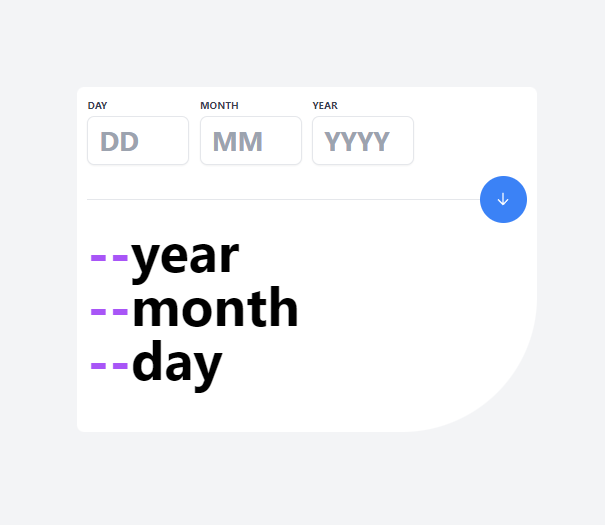
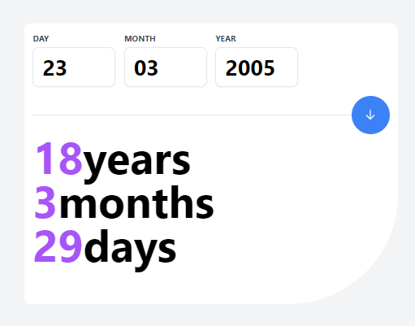
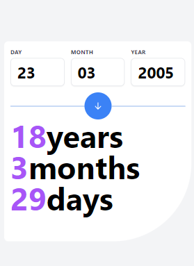

# Frontend Mentor - Age calculator app solution

This is a solution to the [Age calculator app challenge on Frontend Mentor](https://www.frontendmentor.io/challenges/age-calculator-app-dF9DFFpj-Q). Frontend Mentor challenges help you improve your coding skills by building realistic projects.

## Table of contents

- [Overview](#overview)
    - [The challenge](#the-challenge)
    - [Screenshot](#screenshot)
    - [Links](#links)
- [My process](#my-process)
    - [Built with](#built-with)
    - [What I learned](#what-i-learned)
    - [Continued development](#continued-development)
    - [Useful resources](#useful-resources)
- [Author](#author)
- [Acknowledgments](#acknowledgments)

**Note: Delete this note and update the table of contents based on what sections you keep.**

## Overview

### The challenge

Users should be able to:

- View an age in years, months, and days after submitting a valid date through the form
- Receive validation errors if:
    - Any field is empty when the form is submitted
    - The day number is not between 1-31
    - The month number is not between 1-12
    - The year is in the future
    - The date is invalid e.g. 31/04/1991 (there are 30 days in April)
- View the optimal layout for the interface depending on their device's screen size
- See hover and focus states for all interactive elements on the page
- **Bonus**: See the age numbers animate to their final number when the form is submitted

### Screenshots

#### Desktop view

#### Mobile View

### Links

- Solution URL: [https://github.com/Wasaanyi/age-calculator](https://github.com/Wasaanyi/age-calculator)
- Live Site URL: [https://agecalculatorapp.com](https://agecalculatorapp.gatsbyjs.io/)

## My process

### Built with

- Semantic HTML5 markup
- CSS 
- Flexbox
- CSS Grid
- Mobile-first workflow
- [React](https://reactjs.org/) - JS library
- [Gatsby.js](https://www.gatsbyjs.com/) - React framework
- [TailwindCSS](https://tailwindcss.com/) - CSS framework

### Useful resources

- [ChatGpt](https://chat.openai.com/) - This helped me put together the overall date validation function.
- [useState React Documentation](https://react.dev/reference/react/useState) - This is an amazing reference for understanding about useState. I'd recommend it to anyone still learning this concept.

## Author

- Website - [James_Wasaanyi](https://www.linkedin.com/in/jameswasaanyi)
- Frontend Mentor - [@Wasaanyi](https://www.frontendmentor.io/profile/wasaanyi)

**Note: Delete this note and add/remove/edit lines above based on what links you'd like to share.**

## Acknowledgments

This is where you can give a hat tip to anyone who helped you out on this project. Perhaps you worked in a team or got some inspiration from someone else's solution. This is the perfect place to give them some credit.

**Note: Delete this note and edit this section's content as necessary. If you completed this challenge by yourself, feel free to delete this section entirely.**
